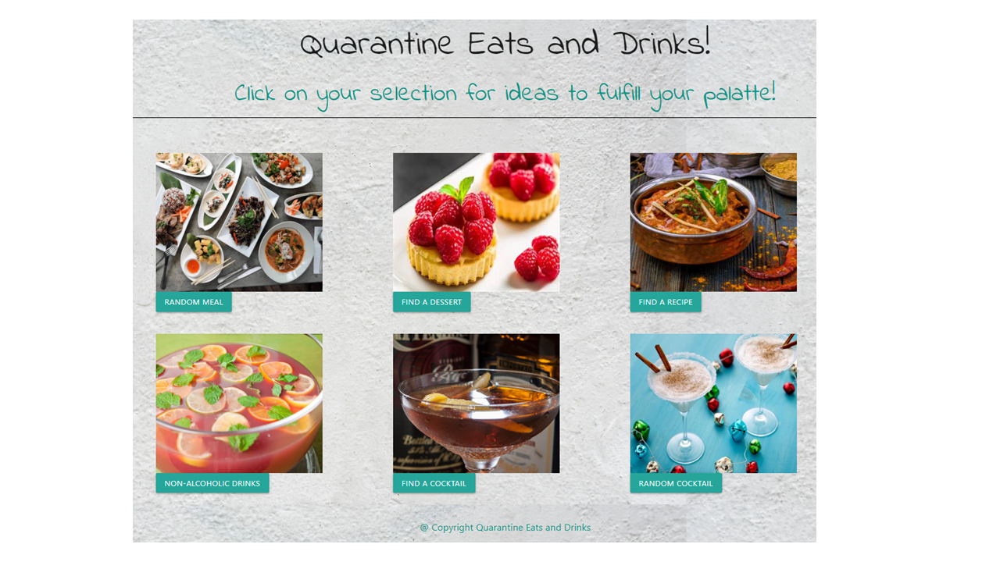

# Quarantine Eats and Drinks!

### Project 1

## Project Description
As a person in quarantine, it doesn't mean that we can't have a good meal and a nice cocktail. Anyone can use this application to inspire and instruct any user on how to make a variety of dishes and drinks at home.

* [Link: Quarantine Eats & Drinks](https://jonafi.github.io/quarantine-eats/index.html)

## High-level instructions
* Find a random cocktail recipe
* Search for a cocktail by name
* Browse non-alcoholic cocktail ideas
* Find a random meal you can prepare at home
* Search for a specific recipe by keyword
* Browse desserts

## Sources
* Materialize CSS Framework (https://materializecss.com/)
* Google Fonts (https://fonts.google.com/)
* Font Awesome (https://fontawesome.com/)
* The Cocktail DB API (https://www.thecocktaildb.com/)
* The Meal DB API (https://www.themealdb.com/api.php)